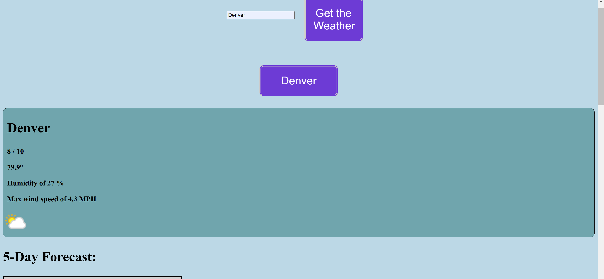

# Weather-Dashboard

This weather dashboard is designed to pull weather info from an API and display back symple feedback for the common-folk to understand

## How to Use
 
Upon entering the site, you will be able to search locations via City name that you want to know the current weather and 5 day forecast. Type in the city name and hit search. The forcast will populate and show you what the weather is.

### Preview

### Links

